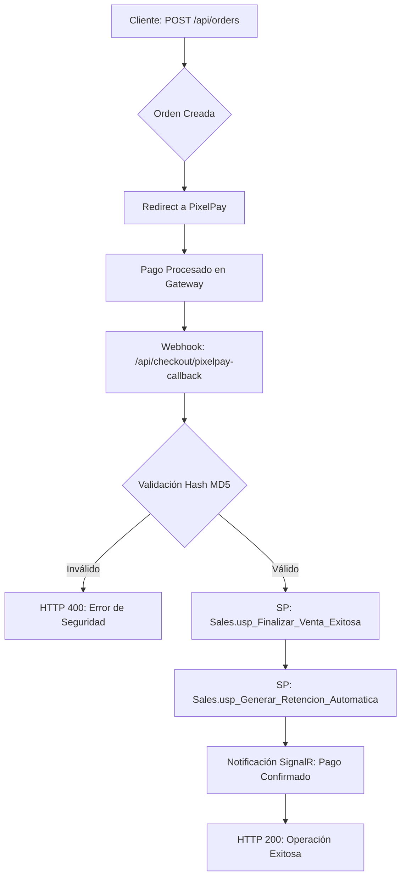

# Inventario Técnico de Endpoints: Web API InverbanHN / Biofarma

Este documento detalla exhaustivamente los endpoints de la API, su lógica de negocio asociada a las reglas de Honduras, estructuras de datos y dependencias SQL.

---

## 1. Flujo de Checkout (Mermaid)

Representación del ciclo de vida de una orden desde su creación hasta la confirmación de pago y orquestación post-venta.



---

## 2. Inventario de Endpoints

### 2.1 Módulo de Ventas (Sales)

#### **POST /api/checkout/pixelpay-callback**
- **Propósito**: Webhook para confirmar pagos desde PixelPay.
- **Acceso**: Webhook Externo (Seguridad vía Hash MD5).
- **Lógica**: Valida integridad de datos y dispara `usp_Finalizar_Venta_Exitosa`.
- **Request DTO**:
  ```json
  {
    "order_id": "string",
    "amount": "decimal",
    "currency": "string (HNL)",
    "hash": "string (MD5)",
    "result": "string (success/approved)",
    "bank_reference": "string"
  }
  ```
- **Conexiones SQL**: `[Sales].[usp_Finalizar_Venta_Exitosa]`.

#### **POST /api/admin/orders/cancel-refund**
- **Propósito**: Cancelación administrativa con crédito automático a la Wallet.
- **Acceso**: Roles: `SuperAdmin`, `CustomerService`.
- **Lógica**: Reclama saldo y notifica al cliente vía correo y SignalR.
- **Request DTO**:
  ```json
  {
    "orderId": "string",
    "reason": "string"
  }
  ```
- **Conexiones SQL**: `[Sales].[usp_Cancelar_Orden_Con_Reembolso]`.

---

### 2.2 Módulo de Impuestos y Facturación (Tax & Billing)

#### **POST /api/tax/process/{subOrderId}**
- **Propósito**: Orquestar facturación SAR y retenciones de ISR.
- **Acceso**: `Admin`, `System`.
- **Lógica**: Si la tienda es `Autoimpresor`, consume rangos CAI. Si es sujeta a retención, genera el 1% de ISR.
- **Errores Específicos**:
  - `50060`: Error de Facturación (Falta configurar rangos CAI o Rango Agotado).
- **Conexiones SQL**: `[Sales].[usp_Procesar_Facturacion_Orden]`, `[Sales].[usp_Generar_Retencion_Automatica]`.

#### **POST /api/admin/stores**
- **Propósito**: Crear tiendas y configurar parámetros SAR.
- **Acceso**: `SuperAdmin`.
- **Request DTO**:
  ```json
  {
    "storeName": "string",
    "rtn": "string (14 dígitos)",
    "inventoryMode": "string (Tienda/Ecommerce)",
    "billingType": "string (Autoimpresor/Managed)",
    "cai": "string (Opcional)",
    "rangeStart": "long (Opcional)",
    "rangeEnd": "long (Opcional)",
    "caiExpiryDate": "datetime (Opcional)"
  }
  ```

---

### 2.3 Módulo de Marketing y Fidelización

#### **POST /api/wallet/{id}/redeem**
- **Propósito**: Canje de Gift Cards.
- **Acceso**: `Customer` (Dueño de la cuenta).
- **Lógica**: Valida código contra IP para evitar fuerza bruta (Bloqueo 15 min).
- **Request DTO**:
  ```json
  {
    "code": "string"
  }
  ```
- **Conexiones SQL**: `[Marketing].[usp_Canjear_Gift_Card_Seguro]`, `[Marketing].[v_Auditoria_GiftCards_Pendientes]`.

---

### 2.4 Módulo de Billetera (Wallet)

#### **POST /api/wallet/{id}/mixed-payment**
- **Propósito**: Cálculo y ejecución de pago con saldo de billetera virtual.
- **Acceso**: `Customer`.
- **Lógica**: Descuenta saldo de `CustomerWallets` y registra el débito en `WalletTransactions`.
- **Request DTO**:
  ```json
  {
    "totalOrder": "decimal",
    "useWallet": "boolean",
    "orderId": "string"
  }
  ```
- **Response JSON (Exitoso)**:
  ```json
  {
    "totalOrder": 1250.50,
    "walletAmountUsed": 500.00,
    "diferenciaPendiente": 750.50
  }
  ```

---

## 3. Conexiones SQL Críticas (Vistas y SPs)

| Nombre Objeto | Tipo | Módulo | Descripción |
| :--- | :--- | :--- | :--- |
| `[Sales].[v_Export_Banca_En_Linea]` | Vista | Sales | Datos para transferencia masiva a bancos. |
| `[Sales].[v_Facturas_Pendientes_Carga]` | Vista | Admin | Monitoreo de facturas físicas pendientes en Ecommerce. |
| `[Marketing].[v_Auditoria_GiftCards_Pendientes]` | Vista | Analytics | Pasivo financiero por Gift Cards no canjeadas. |
| `[Sales].[usp_Finalizar_Venta_Exitosa]` | SP | Sales | Orquestador post-pago (Inventario + Estado). |
| `[Sales].[usp_Generar_Retencion_Automatica]` | SP | Tax | Cálculo fiscal de ISR 1% en Honduras. |

---

## 4. Tabla de Códigos de Error

| Código | Mensaje de Error | Acción Recomendada |
| :--- | :--- | :--- |
| `429` | Demasiados intentos fallidos. | Bloqueo por seguridad (Gift Card). Esperar 15 min. |
| `50060` | Falta configurar rangos CAI. | Admin debe configurar el CAI en el panel de Tienda. |
| `409` | Conflicto de concurrencia. | El saldo cambió durante la transacción. Reintentar. |
| `403` | Forbidden (Store ID Mismatch). | El usuario intenta gestionar productos de otra tienda. |

---
**Generado por**: Arquitectura de Software INVERBANHN / Biofarma.
**Versión**: 1.0 (Compatible con .NET 10).
