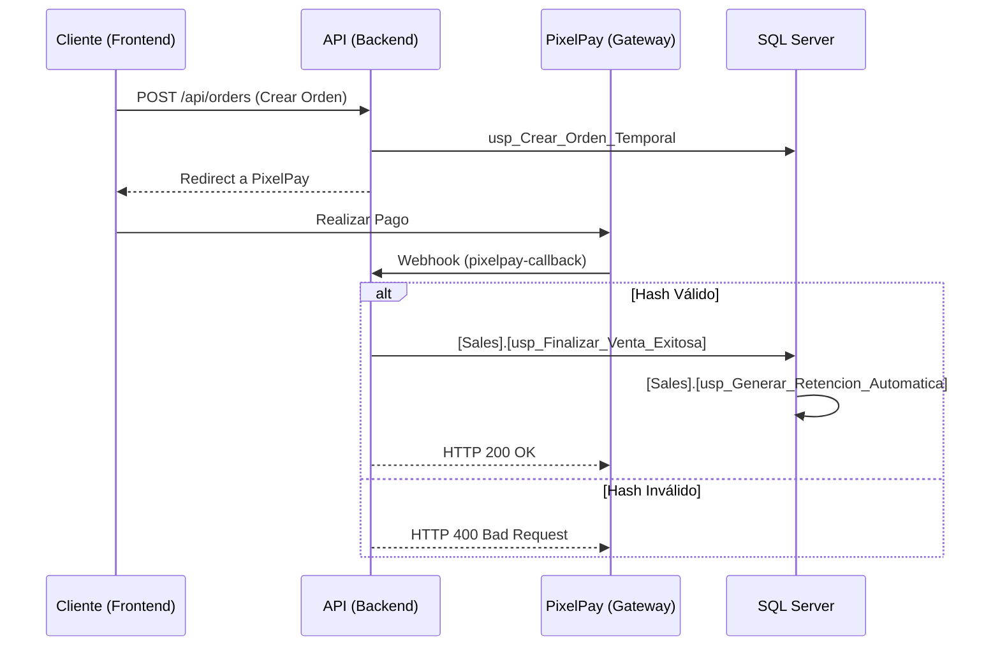

# Documentación Técnica: API Ecosistema Marketplace (InverbanHN / Biofarma)

Bienvenido a la documentación técnica oficial de la API del Ecosistema Marketplace. Esta API actúa como el núcleo transaccional y operativo para el Marketplace multi-tenant líder en Honduras, integrando logística avanzada, cumplimiento fiscal y servicios financieros digitales.

## Tabla de Contenidos
- [Contexto de Negocio](#contexto-de-negocio)
- [Arquitectura de Controladores](#arquitectura-de-controladores)
    - [Módulo de Ventas (Sales)](#módulo-de-ventas)
    - [Módulo de Catálogo (Catalog)](#módulo-de-catálogo)
    - [Módulo de Logística (Logistics)](#módulo-de-logística)
    - [Módulo de Marketing](#módulo-de-marketing)
- [Dependencias SQL Críticas](#dependencias-sql-críticas)
- [Integraciones de Terceros (PixelPay)](#integraciones-de-terceros)
- [Flujo de Wallet y Ledger](#flujo-de-wallet-y-ledger)
- [Proceso de Compra (Diagrama de Flujo)](#proceso-de-compra)
- [Ejemplos de Referencia](#ejemplos-de-referencia)

---

## Contexto de Negocio

La API del Ecosistema Marketplace está diseñada para operar en el mercado hondureño bajo un modelo **Multi-tenant**, permitiendo que múltiples tiendas (vendedores) gestionen su inventario y ventas de forma aislada pero compartiendo la infraestructura logística y de pagos.

### Características Clave:
- **Facturación Híbrida**: Soporta dos modalidades de cumplimiento fiscal:
    - **Autoimpresores SAR**: Generación automática de facturas cumpliendo con los rangos CAI para tiendas formalizadas.
    - **Carga Manual**: Para tiendas informales o con sistemas externos, permitiendo la carga de la factura emitida físicamente para trazabilidad en el ecommerce.
- **Retenciones de ISR Automatizadas**: El sistema detecta si una tienda es sujeta a retención de impuesto (1% ISR) y genera el comprobante de retención automáticamente al momento de la liquidación de la venta, asegurando el cumplimiento tributario sin intervención manual.
- **Localización**: Optimizado para montos en Lempiras (LPS) y cumplimiento de normativas de la SAR.

---

## Arquitectura de Controladores

### Módulo de Ventas (Sales)

| Endpoint | Propósito | Seguridad | Parámetros Clave |
| :--- | :--- | :--- | :--- |
| `POST /api/checkout/pixelpay-callback` | Orquestador de post-venta tras pago exitoso. | Webhook (Hash MD5) | `OrderId`, `Amount` (LPS), `Hash` |
| `POST /api/admin/orders/cancel-refund` | Cancela orden y acredita reembolso a Wallet. | SuperAdmin, CS | `OrderId`, `Reason` |
| `POST /api/wallet/{id}/mixed-payment` | Procesa pagos combinando saldo Wallet y Diferencia. | Customer | `TotalOrder`, `UseWallet` |

### Módulo de Catálogo (Catalog)

| Endpoint | Propósito | Seguridad | Parámetros Clave |
| :--- | :--- | :--- | :--- |
| `GET /api/products/my` | Lista productos de la tienda autenticada. | StoreAdmin | N/A (Filtro por JWT) |
| `POST /api/products/bulk-upload` | Carga masiva vía Excel (.xlsx). | StoreAdmin | `file` (Multipart) |
| `GET /api/products/categories` | Catálogo de categorías y comisiones. | Público | N/A |

### Módulo de Logística (Logistics)

| Endpoint | Propósito | Seguridad | Parámetros Clave |
| :--- | :--- | :--- | :--- |
| `POST /api/admin/carriers/rates` | Configura tarifas por ruta (Origen-Destino). | Admin | `CostToEcommerce`, `PriceToCustomer` |
| `GET /api/admin/carriers/{id}/settlement` | Calcula liquidación pendiente para transportista. | Admin | `CarrierId` |

### Módulo de Marketing

| Endpoint | Propósito | Seguridad | Parámetros Clave |
| :--- | :--- | :--- | :--- |
| `POST /api/wallet/{id}/redeem` | Canje de Gift Cards con protección anti-fraude. | Customer | `Code` |
| `GET /api/admin/analytics/gift-cards/liability` | Consulta pasivo financiero por Gift Cards. | Admin | N/A |

---

## Dependencias SQL Críticas

La inteligencia de negocio y la integridad financiera residen en procedimientos almacenados optimizados:

1.  **`[Sales].[usp_Finalizar_Venta_Exitosa]`**:
    - **Función**: Orquestador principal de éxito. Reduce inventario, cambia estado de orden a "Pagado", y prepara el registro para logística.
    - **Gatillo**: Invocado por `CheckoutController` tras validar el Webhook de PixelPay.

2.  **`[Sales].[usp_Generar_Retencion_Automatica]`**:
    - **Función**: Calcula el 1% del subtotal de la venta para tiendas configuradas con `HasIsrWithholding = true`. Genera el registro contable de retención que se deduce de la liquidación final al vendedor.

3.  **`[Marketing].[usp_Canjear_Gift_Card_Seguro]`**:
    - **Función**: Sistema de seguridad que valida el código, acredita el saldo al cliente y bloquea intentos por IP o Cuenta en caso de ataques de fuerza bruta.

---

## Integraciones de Terceros

### PixelPay (Pasarela de Pagos)
La API utiliza un flujo de validación de integridad para prevenir el fraude en las notificaciones de pago:
1.  **Recepción**: PixelPay envía un POST al callback.
2.  **Validación de Hash**: Se concatena `SecretKey + OrderId + Amount + Currency`.
3.  **Comparación**: Se genera un MD5 del string y se compara con el `Hash` recibido. Solo si coinciden, se procede a ejecutar la lógica de `usp_Finalizar_Venta_Exitosa`.

---

## Flujo de Wallet y Ledger

El sistema utiliza un **Libro Mayor (Ledger)** para asegurar que cada movimiento de saldo sea auditable y atómico.

- **Cancelaciones**: Si un Administrador cancela una orden pagada, el SP `[Sales].[usp_Cancelar_Orden_Con_Reembolso]` revierte el flujo financiero, debitando la cuenta de "Ventas Pendientes" y acreditando la "Virtual Wallet" del cliente.
- **Pagos Mixtos**: Permite usar saldo parcial de la Wallet y pagar el excedente con tarjeta, manteniendo la integridad del saldo mediante bloqueos optimistas en la base de datos.

---

## Proceso de Compra



---

## Ejemplos de Referencia

### Request: Canje de Gift Card
`POST /api/wallet/450/redeem`
```json
{
  "code": "GIFT-2024-X89Z"
}
```

### Response: Éxito con Retención Automática (Contexto Interno)
```json
{
  "message": "Pago procesado correctamente.",
  "billingDetails": {
    "orderId": "ORD-7721",
    "total": 1500.00,
    "currency": "LPS",
    "withholdingGenerated": true,
    "withholdingAmount": 15.00
  }
}
```

### Notificación de Error: Bloqueo de Seguridad
```json
{
  "error": "Demasiados intentos fallidos. Su cuenta ha sido bloqueada temporalmente.",
  "minutosRestantes": 15
}
```

---
**Nota**: Esta documentación es de uso interno para el equipo de desarrollo de INVERBANHN / Biofarma. Los montos reflejados están sujetos a las tasas de cambio y políticas fiscales vigentes de Honduras.
